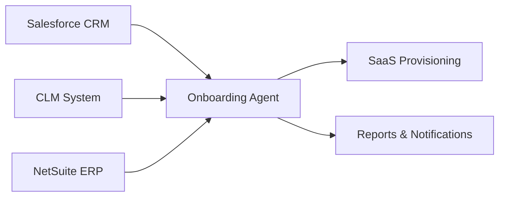
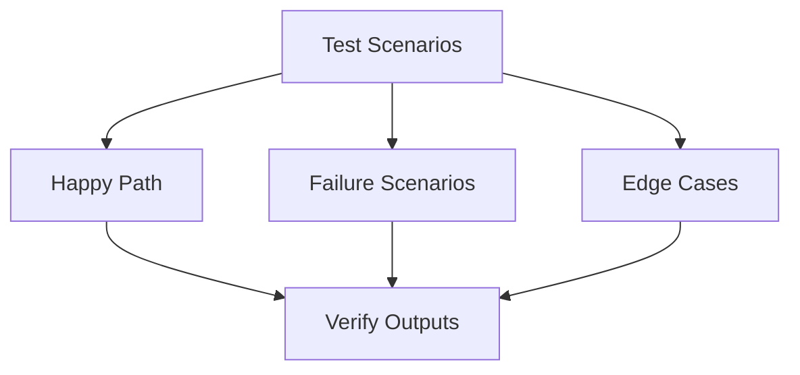
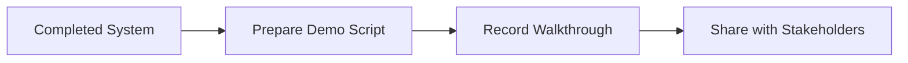

# Enterprise Onboarding Agent – Progress Report

## Executive Summary

Over the past phase, I have completed the **end-to-end solution design and core implementation** of an automated Enterprise Customer Onboarding Agent. The system integrates multiple enterprise platforms, enforces validation and risk controls, and produces production-quality reporting and notifications.

The project has now transitioned from **implementation** to **system validation and scenario testing**, with a **demo walkthrough** planned next.

---

## ✅ Completed Work

### 1. Solution Architecture & Design
- Finalized overall **agent-oriented orchestration design**
- Defined **clear system boundaries** between CRM, CLM, ERP, and SaaS provisioning
- Designed **state-driven onboarding flow** with deterministic outcomes (PROCEED / ESCALATE / BLOCK)
- Established consistent **error taxonomy and reporting strategy**

### 2. Salesforce CRM Integration
- Implemented Salesforce Account, User, Opportunity, and Contract retrieval
- Added **explicit handling of API errors vs business “not found” cases**
- Ensured Salesforce failures halt onboarding with full diagnostic context
- Integrated Salesforce data into agent decision logic

### 3. CLM (Contract Lifecycle Management) Integration
- Implemented contract lookup by account
- Added support for authentication, authorization, validation, and server errors
- Exposed contract execution and signatory status
- Integrated CLM failures into unified reporting and escalation flow

### 4. NetSuite ERP (Billing & Invoicing) Integration
- Implemented invoice retrieval and transformation into agent-friendly format
- Supported Paid, Open, Overdue, Draft, and Not Found scenarios
- Distinguished billing issues from system errors
- Integrated billing state into risk analysis and onboarding decisions

### 5. SaaS Provisioning Logic
- Implemented SaaS tenant provisioning workflow
- Linked provisioning eligibility to contract, billing, and risk checks
- Captured provisioning outputs for reporting and notifications

### 6. Error Handling & Observability
- Centralized API error capture across all integrations
- Each error includes system, operation, raw message, HTTP status, entity context, and correlation ID
- Eliminated silent or swallowed failures
- Ensured onboarding halts immediately on integration failures

### 7. Logging & Correlation
- Implemented correlation IDs for full run traceability
- All logs, reports, and notifications are tied to a single onboarding run
- Enables rapid debugging and auditability

### 8. Reporting & Notifications
- Implemented Markdown run reports
- Implemented HTML email notifications (success, blocked, API errors)
- Reports include decision outcome, risk analysis, violations, actions, notifications, provisioning status, and diagnostics

### 9. Simulation & Testing Infrastructure
- Built deterministic error simulation for all external systems
- Enables testing of failure paths without live dependencies

---

## 📊 Completed Architecture (High-Level)

---

## 🔄 In Progress

### System Validation & Scenario Testing
- Executing onboarding runs across happy-path, failure, and edge-case scenarios
- Verifying correctness of decisions, reports, notifications, and logs

---

## 🗓 Planned Next Steps

### Demo Preparation & Walkthrough
- Prepare a recorded end-to-end demo walkthrough
- Demonstrate integrations, error handling, and reporting
- Share with stakeholders for review and alignment

---

## Overall Status

| Area | Status |
|-----|-------|
| Solution Design | ✅ Complete |
| Core Integrations | ✅ Complete |
| Error Handling & Reporting | ✅ Complete |
| SaaS Provisioning | ✅ Complete |
| Scenario Testing | 🔄 In Progress |
| Demo Walkthrough | 🗓 Planned |
