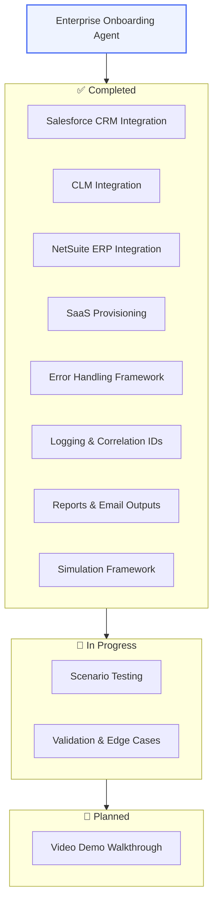

# Enterprise Onboarding Agent – Status Overview

```mermaid
flowchart TD
    A[Enterprise Onboarding Agent]:::core

    subgraph C[✅ Completed]
        C1[Salesforce CRM Integration]
        C2[CLM Integration]
        C3[NetSuite ERP Integration]
        C4[SaaS Provisioning]
        C5[Error Handling Framework]
        C6[Logging & Correlation IDs]
        C7[Reports & Email Outputs]
        C8[Simulation Framework]
    end

    subgraph P[🧪 In Progress]
        P1[Scenario Testing]
        P2[Validation & Edge Cases]
    end

    subgraph F[🎥 Planned]
        F1[Video Demo Walkthrough]
    end

    A --> C
    C --> P
    P --> F

    classDef core fill:#eef3ff,stroke:#4c6ef5,stroke-width:2px
```
