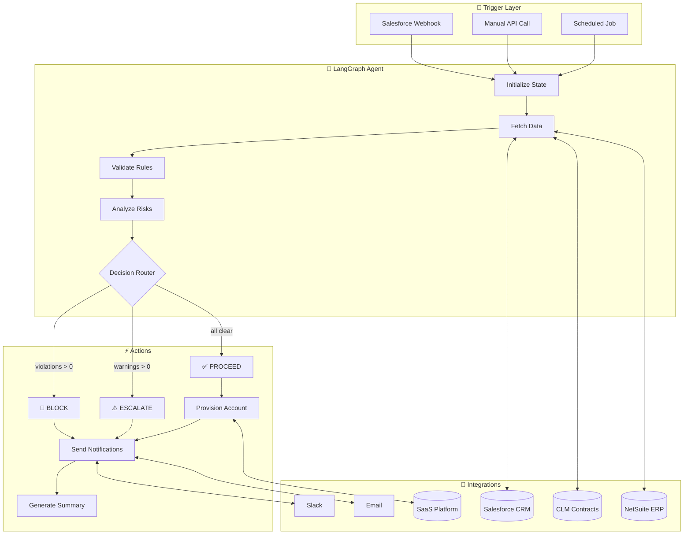
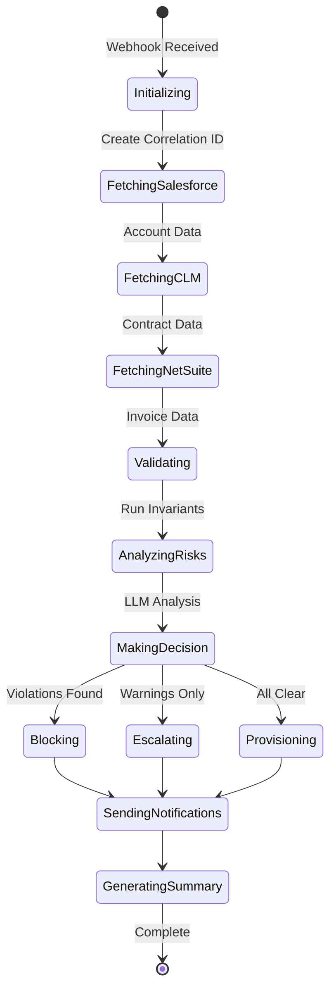
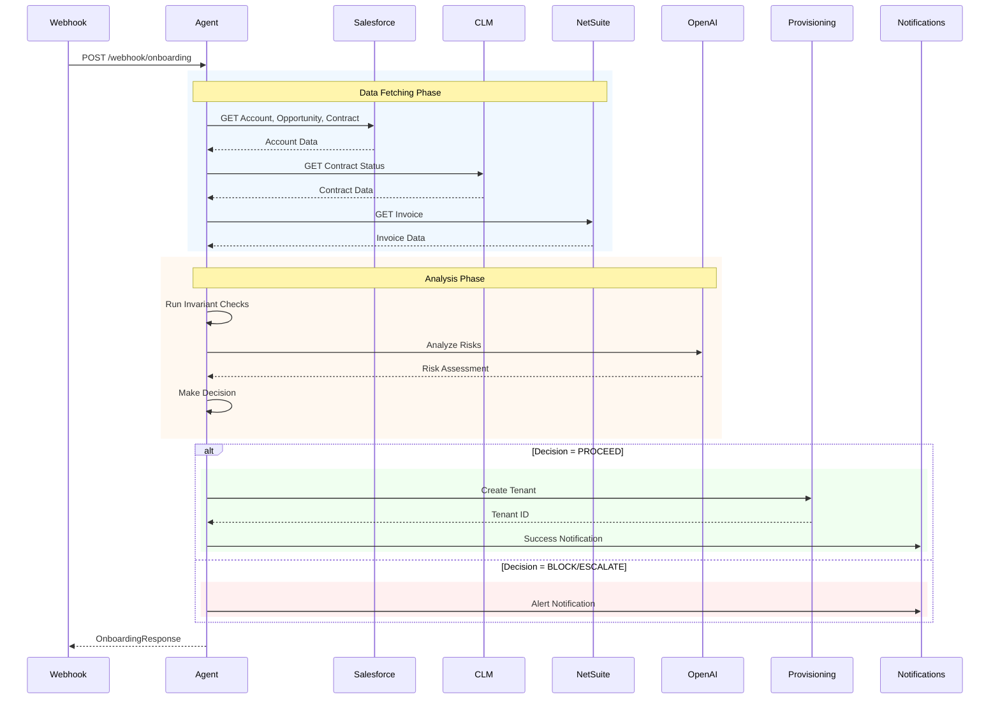
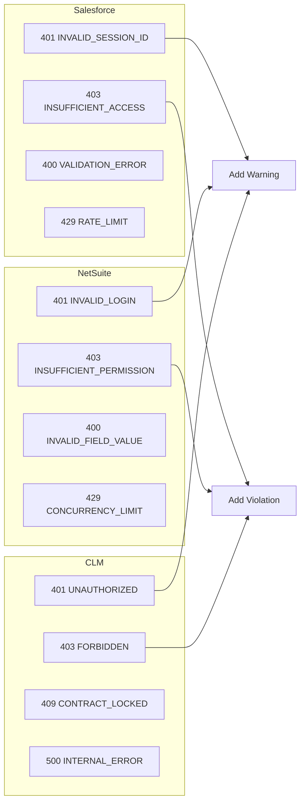

# Enterprise Onboarding Agent

An AI-powered customer onboarding automation agent built with LangGraph, demonstrating how autonomous agents can streamline enterprise SaaS onboarding workflows.

## 🎯 Overview

This agent automates the customer journey from **Sales → Contract → Invoice → Provisioning**, featuring:

- **Autonomous Decision Making**: PROCEED / ESCALATE / BLOCK based on business rules
- **LLM-Powered Risk Analysis**: Intelligent risk assessment with actionable recommendations
- **Multi-System Integration**: Salesforce, CLM, NetSuite, and SaaS provisioning (mocked)
- **Realistic Error Simulation**: Auth failures, permission errors, validation errors, server errors
- **Proactive Notifications**: Slack and email alerts to stakeholders
- **Report Generation**: HTML emails, Markdown reports, JSON audit logs
- **Full Observability**: LangSmith tracing, structured JSON logging, audit trails

## 📚 Documentation

- **[Solution Design Document](docs/SOLUTION_DESIGN.md)** - Full architecture, trade-offs, MCP collaboration overview

## 🏗️ Architecture

### High-Level Flow



### State Machine



### Data Flow



## 🚀 Quick Start

### Prerequisites

- Python 3.11+
- OpenAI API key (optional - uses rule-based fallback without it)
- LangSmith API key (optional - for tracing)

### Installation

```bash
cd onboarding-agent

# Create virtual environment
python -m venv venv
source venv/bin/activate  # On Windows: venv\Scripts\activate

# Install dependencies
pip install -r requirements.txt

# Set up environment
cp .env.example .env
# Edit .env with your API keys
```

### Run the Demo

```bash
# Run standalone demo (no dependencies needed)
python demo_standalone.py

# Or start the API server
uvicorn main:app --reload

# Open API docs at http://localhost:8000/docs
```

## 📋 Demo Scenarios

### Normal Scenarios

| Account ID | Scenario | Expected Decision |
|------------|----------|-------------------|
| ACME-001 | Happy Path | ✅ PROCEED |
| BETA-002 | Opportunity Not Won | 🚫 BLOCK |
| GAMMA-003 | Overdue Invoice | ⚠️ ESCALATE |
| DELETED-004 | Deleted Account | 🚫 BLOCK |

### Error Simulation Scenarios

| Account ID | Simulated Error | Description |
|------------|-----------------|-------------|
| AUTH-ERROR | 401 Unauthorized | Invalid API credentials |
| PERM-ERROR | 403 Forbidden | Missing permissions |
| SERVER-ERROR | 500 Server Error | API server failure |

## 🔌 API Endpoints

### Core Endpoints

| Method | Endpoint | Description |
|--------|----------|-------------|
| GET | `/health` | Health check |
| POST | `/webhook/onboarding` | Main onboarding trigger |
| POST | `/debug/onboarding` | Test with custom data |

### Demo Endpoints

| Method | Endpoint | Description |
|--------|----------|-------------|
| GET | `/demo/scenarios` | List all scenarios |
| POST | `/demo/run/{account_id}` | Run specific scenario |
| POST | `/demo/run-all` | Run all normal scenarios |
| POST | `/demo/run-error-scenarios` | Run error scenarios |
| POST | `/demo/run-with-report/{account_id}` | Run and generate reports |

### Report Endpoints

| Method | Endpoint | Description |
|--------|----------|-------------|
| GET | `/demo/reports` | List generated reports |
| GET | `/demo/reports/{filename}` | View report (renders HTML) |
| GET | `/demo/reports/{filename}/download` | Download report |

## 📧 Generated Reports

The agent generates professional reports for each run:

- **HTML Email Templates** - Blocked notifications, success notifications, welcome emails
- **Markdown Reports** - Complete run summary with violations, warnings, actions
- **JSON Audit Logs** - Machine-readable audit trail

## 🔧 Error Handling



## 📁 Project Structure

```
onboarding-agent/
├── main.py                      # FastAPI application
├── demo_standalone.py           # Standalone demo script
├── docs/
│   └── SOLUTION_DESIGN.md       # Full solution design document
├── reports_output/              # Generated reports directory
└── app/
    ├── agent/                   # LangGraph workflow
    │   ├── graph.py            # Workflow definition
    │   ├── nodes.py            # Processing steps
    │   ├── router.py           # Decision routing
    │   └── invariants/         # Business rules
    ├── api/                    # REST endpoints
    ├── integrations/           # Mock API clients
    │   ├── salesforce.py       # Salesforce CRM
    │   ├── clm.py              # Contract Lifecycle
    │   ├── netsuite.py         # NetSuite ERP
    │   ├── provisioning.py     # SaaS provisioning
    │   └── api_errors.py       # Shared error types
    ├── llm/                    # LLM integration
    ├── notifications/          # Slack/Email
    ├── reports/                # Report generation
    └── logging/                # Structured logging
```

## 🔒 Security Features

- OAuth simulation with token expiry
- Permission checking before API calls
- Credential validation
- Audit logging with correlation IDs
- Error masking (no sensitive data in responses)

## 📊 Observability

With LangSmith tracing enabled, you can:
- View full execution traces
- Debug agent decisions
- Monitor latency and token usage
- Analyze LLM calls

## 📄 License

MIT License - Built for StackAdapt Case Study
