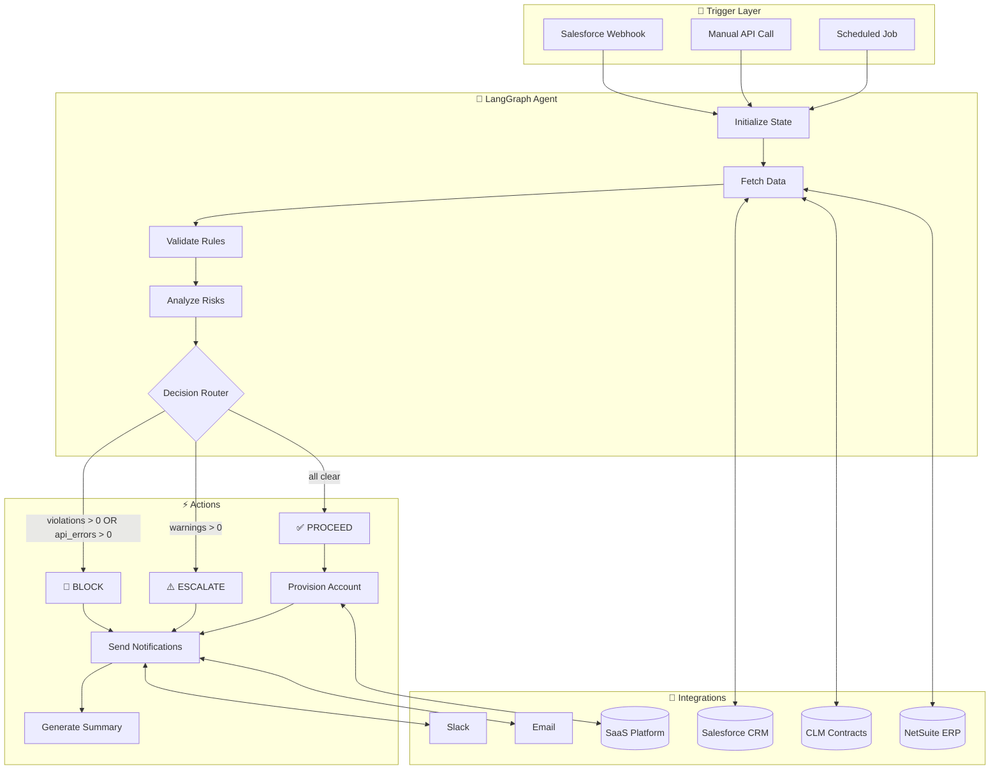
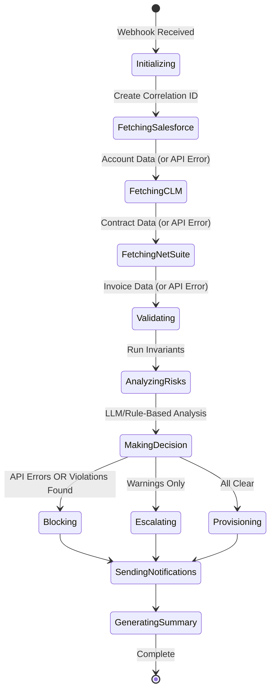
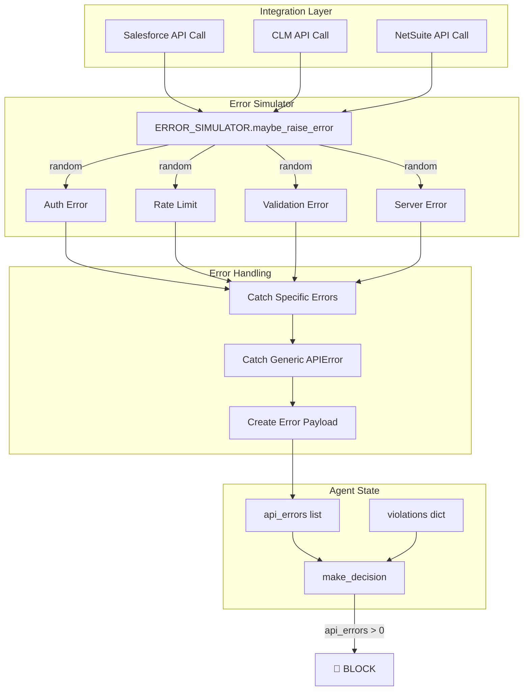

# Enterprise Onboarding Agent

An AI-powered customer onboarding automation agent built with LangGraph, demonstrating how autonomous agents can streamline enterprise SaaS onboarding workflows.

## 🎯 Overview

This agent automates the customer journey from **Sales → Contract → Invoice → Provisioning**, featuring:

- **Autonomous Decision Making**: PROCEED / ESCALATE / BLOCK based on business rules and API errors
- **LLM-Powered Risk Analysis**: Intelligent risk assessment with actionable recommendations
- **Multi-System Integration**: Salesforce, CLM, NetSuite, and SaaS provisioning (mocked)
- **Configurable Error Simulation**: Auth failures, permission errors, validation errors, rate limits, server errors with adjustable probabilities
- **Comprehensive Error Handling**: API errors are properly caught, recorded, and influence decisions
- **Proactive Notifications**: Slack and email alerts to stakeholders
- **Report Generation**: HTML emails, Markdown reports, JSON audit logs
- **Full Observability**: LangSmith tracing, structured JSON logging, audit trails

## 📚 Documentation

- **[Solution Design Document](docs/SOLUTION_DESIGN.md)** - Full architecture, trade-offs, MCP collaboration overview

## 🏗️ Architecture

### High-Level Flow



### Decision Logic

The agent makes decisions based on three factors:

1. **API Errors** (`api_errors`): System integration failures (auth, rate limits, server errors) → **BLOCK**
2. **Violations** (`violations`): Business rule failures (missing data, invalid states) → **BLOCK**  
3. **Warnings** (`warnings`): Non-critical issues (missing optional fields, pending payments) → **ESCALATE**
4. **All Clear**: No errors, violations, or warnings → **PROCEED**

### State Machine



## 🚀 Quick Start

### Prerequisites

- Python 3.11+
- [uv](https://docs.astral.sh/uv/) (recommended) or pip
- OpenAI API key (optional - uses rule-based fallback without it)
- LangSmith API key (optional - for tracing)

### Installation

#### Option 1: Using uv (Recommended - Faster)

[uv](https://docs.astral.sh/uv/) is a fast Python package installer and resolver.

```bash
# Install uv if you don't have it
curl -LsSf https://astral.sh/uv/install.sh | sh

# Create virtual environment and install dependencies
uv init
uv add -r requirements.txt

# Set up environment
cp .env.example .env
# Edit .env with your API keys
```

#### Option 2: Using pip

```bash
cd onboarding-agent

# Create virtual environment
python -m venv venv
source venv/bin/activate  # On Windows: venv\Scripts\activate

# Install dependencies
pip install -r requirements.txt

# Set up environment
cp .env.example .env
# Edit .env with your API keys
```

### Run the Demo

```bash
# Run standalone demo (no server needed)
python demo_standalone.py

# Or start the API server
uvicorn main:app --reload

# Open API docs at http://localhost:8000/docs
```

## 📋 Demo Scenarios

### Normal Scenarios

| Account ID | Scenario | Expected Decision |
|------------|----------|-------------------|
| ACME-001 | Happy Path | ✅ PROCEED |
| BETA-002 | Opportunity Not Won | 🚫 BLOCK |
| GAMMA-003 | Overdue Invoice | ⚠️ ESCALATE |
| DELETED-004 | Deleted Account | 🚫 BLOCK |

### Error Simulation

Enable configurable error injection to test resilience:

```bash
# Enable 100% auth error rate
POST /demo/enable-random-errors?auth_rate=1.0

# Enable mixed error rates
POST /demo/enable-random-errors?auth_rate=0.1&rate_limit_rate=0.2&server_error_rate=0.05

# Check current simulator status
GET /demo/error-simulator-status

# Disable error simulation
POST /demo/disable-random-errors
```

| Error Type | Description | HTTP Code |
|------------|-------------|-----------|
| `auth_rate` | Authentication failures | 401 |
| `validation_rate` | Validation errors | 400 |
| `rate_limit_rate` | Rate limit exceeded | 429 |
| `server_error_rate` | Server errors | 500 |

## 🔌 API Endpoints

### Core Endpoints

| Method | Endpoint | Description |
|--------|----------|-------------|
| GET | `/health` | Health check |
| POST | `/webhook/onboarding` | Main onboarding trigger |
| POST | `/debug/onboarding` | Test with custom data |

### Demo Endpoints

| Method | Endpoint | Description |
|--------|----------|-------------|
| GET | `/demo/scenarios` | List all scenarios |
| POST | `/demo/run/{account_id}` | Run specific scenario |
| POST | `/demo/run-all` | Run all scenarios |
| POST | `/demo/run-with-reports` | Run all with report generation |

### Error Simulation Endpoints

| Method | Endpoint | Description |
|--------|----------|-------------|
| POST | `/demo/enable-random-errors` | Enable error injection with configurable rates |
| POST | `/demo/disable-random-errors` | Disable error injection |
| GET | `/demo/error-simulator-status` | Check current simulator configuration |

### Report Endpoints

| Method | Endpoint | Description |
|--------|----------|-------------|
| GET | `/demo/reports` | List generated reports |
| GET | `/demo/reports/{filename}` | View report (renders HTML) |
| GET | `/demo/reports/{filename}/download` | Download report |

## 🔧 Error Handling Architecture



### Key Error Handling Features

1. **In-Place Error Simulator Modification**: The `ERROR_SIMULATOR` object is modified in-place when enabled, ensuring all modules reference the same instance.

2. **Comprehensive Error Catching**: Each integration module catches both specific error types AND generic `APIError` as a fallback.

3. **Error-Aware Decision Making**: The `make_decision` function checks `api_errors` first, ensuring system failures block onboarding.

4. **Error Details in Reports**: API errors are added to violations and appear in generated reports with full context.

## 📊 Generated Reports

The agent generates professional reports for each run:

- **HTML Email Templates** - Blocked notifications, success notifications, welcome emails
- **Markdown Reports** - Complete run summary with violations, warnings, API errors, and actions
- **JSON Audit Logs** - Machine-readable audit trail with full state

## 📋 Onboarding Task Management

When an account is provisioned, the agent automatically creates a **granular onboarding task checklist** that tracks the CS workflow:

### Task Categories

| Category | Owner | Examples |
|----------|-------|----------|
| **Automated** | System | Create tenant, generate API credentials, send welcome email |
| **CS Action** | CS Team | Schedule kickoff call, configure SSO, create custom reports |
| **Customer Action** | Customer | Verify login, complete platform tour, invite team members |
| **Technical** | CS Team | SSO integration, API setup |

### Task Endpoints

```bash
# Get all tasks for an account
GET /demo/tasks/ACME-001

# Get pending tasks (optionally filter by owner)
GET /demo/tasks/ACME-001/pending?owner=cs_team

# Get overdue tasks (for proactive alerts)
GET /demo/tasks/ACME-001/overdue

# Get next actionable items
GET /demo/tasks/ACME-001/next-actions

# Update task status (CS team marks complete)
PUT /demo/tasks/ACME-001/ACME-001-T005?status=completed&completed_by=john@company.com
```

### Example Task Flow

```
1. ✅ Create Tenant (system - auto-completed)
2. ✅ Generate API Credentials (system - auto-completed)
3. ✅ Send Welcome Email (system - auto-completed)
4. ✅ Send Training Materials (system - auto-completed)
5. ⏳ Schedule Kickoff Call (cs_team - pending, due in 1 day)
6. ⏳ Verify Login Access (customer - pending, due in 2 days)
7. ⏳ Conduct Kickoff Call (cs_team - pending, due in 3 days)
8. ⏳ Complete Platform Tour (customer - pending, due in 5 days)
...
14. ⏳ Onboarding Complete (cs_team - pending, due in 45 days)
```

## 📁 Project Structure

```
onboarding-agent/
├── main.py                      # FastAPI application
├── demo_standalone.py           # Standalone demo script
├── docs/
│   └── SOLUTION_DESIGN.md       # Full solution design document
├── reports_output/              # Generated reports directory
└── app/
    ├── agent/                   # LangGraph workflow
    │   ├── graph.py            # Workflow definition
    │   ├── nodes.py            # Processing steps
    │   ├── router.py           # Decision routing
    │   ├── state.py            # State definition
    │   ├── state_utils.py      # State manipulation utilities
    │   └── invariants/         # Business rules
    ├── api/                    # REST endpoints
    │   ├── demo.py             # Demo endpoints with error simulation
    │   └── webhook.py          # Webhook handlers
    ├── integrations/           # Mock API clients
    │   ├── salesforce.py       # Salesforce CRM
    │   ├── clm.py              # Contract Lifecycle
    │   ├── netsuite.py         # NetSuite ERP
    │   ├── provisioning.py     # SaaS provisioning
    │   └── api_errors.py       # Shared error types & simulator
    ├── llm/                    # LLM integration
    │   └── risk_analyzer.py    # Risk analysis with fallback
    ├── notifications/          # Slack/Email
    ├── reports/                # Report generation
    └── logging/                # Structured logging
```

## 🔒 Security Features

- OAuth simulation with token expiry
- Permission checking before API calls
- Credential validation
- Audit logging with correlation IDs
- Error masking (no sensitive data in responses)

## 📊 Observability

With LangSmith tracing enabled, you can:
- View full execution traces
- Debug agent decisions
- Monitor latency and token usage
- Analyze LLM calls

## 📄 License

MIT License - Built for StackAdapt Case Study
