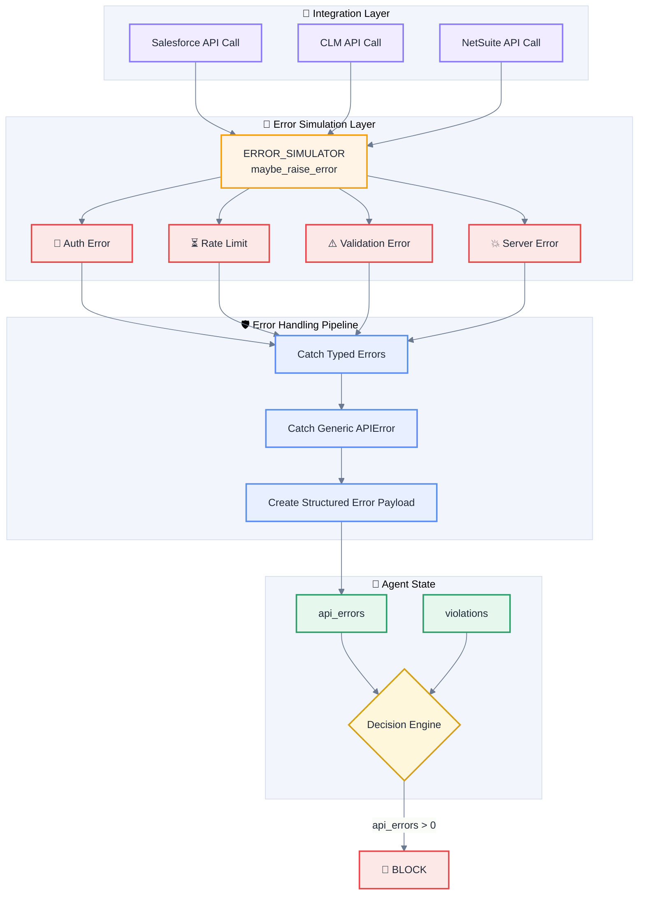

# Enterprise Onboarding Agent

An AI-powered customer onboarding automation agent built with **Pydantic AI + FastMCP**, demonstrating how autonomous agents can streamline enterprise SaaS onboarding workflows using native tool calling.

## 🎯 Overview

This agent automates the customer journey from **Sales → Contract → Invoice → Provisioning**, featuring:

- **Agentic Architecture**: The LLM reasons and decides which tools to call — no hardcoded state machine or graph
- **Native Tool Calling**: 18 tools registered via `@agent.tool` decorators; the agent orchestrates them autonomously
- **MCP-Style Extensibility**: Every tool is mirrored as a FastMCP server definition for future extraction to standalone services
- **Multi-System Integration**: Salesforce, CLM, NetSuite, currency conversion (live API), and SaaS provisioning
- **Live Currency Conversion**: Real-time USD/CAD exchange rates via ExchangeRate API for financial alignment checks
- **Financial Alignment Detection**: Automated comparison of opportunity deal values vs invoice totals across currencies (2% threshold)
- **Configurable Error Simulation**: Auth failures, permission errors, validation errors, rate limits, server errors with adjustable probabilities
- **Comprehensive Error Handling**: API errors are properly caught, recorded, and influence decisions
- **Proactive Notifications**: Slack and email alerts to stakeholders
- **Report Generation**: HTML emails, Markdown reports, JSON audit logs
- **Dual Observability**: Pydantic Logfire + LangSmith tracing (both opt-in), structured JSON logging, audit trails

## 🎥 Video Demo Walkthrough

Watch the full solution walkthrough here:

👉 **[View Demo Video](https://drive.google.com/file/d/1-ztLnzh89_dahqyzBxzX045lJkn83hNs/view?usp=sharing)**


## 🏗️ Architecture

### Agentic Architecture

Unlike a traditional state machine or workflow engine, this agent uses **native LLM tool calling**. The LLM receives a system prompt with business rules and a set of tools, then autonomously reasons through the workflow:

```
LLM Agent (Pydantic AI)
  ├── Fetch Tools (6)      → Salesforce, CLM, NetSuite
  ├── Validation Tools (2) → Business rules, Financial alignment
  ├── Currency Tool (1)    → Live exchange rates (ExchangeRate API)
  ├── Provisioning (1)     → SaaS tenant creation
  └── Notification Tools (8) → Slack, Email, Welcome
```

The agent decides **what to call, in what order, and how many times** based on tool results. Adding a new capability means registering a new `@agent.tool` — zero changes to orchestration logic.

Each tool is also defined as a **FastMCP server** in `app/mcp/`, ready for extraction to standalone MCP services.

### Decision Logic

The agent makes decisions based on three factors:

1. **API Errors** (`api_errors`): System integration failures (auth, rate limits, server errors) → **BLOCK**
2. **Violations** (`violations`): Business rule failures (missing data, invalid states) → **BLOCK**
3. **Warnings** (`warnings`): Non-critical issues (missing optional fields, FX gaps, underpayment) → **ESCALATE**
4. **All Clear**: No errors, violations, or warnings → **PROCEED**

## 🚀 Quick Start

### Prerequisites

- Python 3.11+
- [uv](https://docs.astral.sh/uv/) (recommended) or pip
- OpenAI API key (recommended; falls back to Ollama local model without it)
- LangSmith API key (optional — for tracing)
- Logfire token (optional — for Pydantic AI native tracing)

## 📦 Installation

### Option 1: Using `uv` (Recommended - Faster)

[`uv`](https://docs.astral.sh/uv/) is a fast Python package installer and environment manager.

**macOS / Linux**
```bash
curl -LsSf https://astral.sh/uv/install.sh | sh
```

**Windows (PowerShell)**
```powershell
powershell -ExecutionPolicy ByPass -c "irm https://astral.sh/uv/install.ps1 | iex"
```

**Project setup**
```bash
# Initialize project and virtual environment
uv init

# Install dependencies
uv add -r requirements.txt

# Environment variables
cp .env.example .env
# Edit .env with your API keys
```

---

### Option 2: Using pip (Standard Python)

```bash
# Create virtual environment
python -m venv venv

# Activate virtual environment
# macOS / Linux
source venv/bin/activate
# Windows
venv\Scripts\activate
```

```bash
# Install dependencies
pip install -r requirements.txt

# Environment variables
cp .env.example .env
# Edit .env with your API keys
```

---

### Environment Variables

Create a `.env` file in the project root (or copy from `.env.example`):

```env
# OpenAI (required for GPT-4o; falls back to Ollama if unset)
OPENAI_API_KEY=sk-...
OPENAI_MODEL=gpt-4o-mini

# LangSmith tracing (optional)
LANGCHAIN_API_KEY=ls-...
LANGCHAIN_TRACING_V2=true
LANGCHAIN_PROJECT=onboarding-agent
LANGCHAIN_ENDPOINT=https://api.smith.langchain.com

# Logfire tracing (optional — Pydantic AI native)
LOGFIRE_TOKEN=
LOGFIRE_ENVIRONMENT=development

# Logging
LOG_DIR=logs

# Environment
ENVIRONMENT=development
```

> **Note**: The agent works without tracing keys. OpenAI is recommended for best results; without it, the agent falls back to Ollama (requires a local Ollama server). Currency conversion uses the free ExchangeRate API — no key needed.

---

## ▶️ Running the Application

### Primary Entry Point (Recommended)

The application is designed to be started via `main.py`, which embeds the Uvicorn server programmatically.

```bash
# Using uv
uv run main.py
```

```bash
# Using standard Python
python main.py
```

The server will start on:

```
http://localhost:8000
```

Health check:
```
GET /health
```

Interactive API docs:
```
http://localhost:8000/docs
```

---

### Alternative: Uvicorn CLI (Optional)

If you prefer to run the server using the Uvicorn CLI:

```bash
uvicorn main:app --reload
```

> **Note**: `uvicorn` is still required as a dependency even when running `python main.py`, since it is imported programmatically.

---

## 📋 Demo Scenarios

### Normal Scenarios

| Account ID | Scenario | Expected Decision |
|------------|----------|-------------------|
| ACME-001 | Happy Path — Full Success | ✅ PROCEED |
| BETA-002 | Opportunity Not Won | 🚫 BLOCK |
| GAMMA-003 | Overdue Invoice | ⚠️ ESCALATE |
| DELETED-004 | Deleted Account | 🚫 BLOCK |
| MISSING-999 | Account Not Found | 🚫 BLOCK |
| FOREX-005 | FX Invoice Mismatch (CAD vs USD) | ⚠️ ESCALATE |
| PARTIAL-006 | Partial Payment Gap (5% underpayment) | ⚠️ ESCALATE |

**FOREX-005** demonstrates live currency conversion: the invoice is in CAD ($145,000) while the opportunity is in USD ($100,000). After real-time conversion, the gap exceeds the 2% threshold, triggering escalation.

**PARTIAL-006** demonstrates underpayment detection: $190,000 paid of a $200,000 invoice (5% gap) exceeds the 2% financial alignment threshold.

### Error Simulation

Enable configurable error injection to test resilience:

```bash
# Enable 100% auth error rate
POST /demo/enable-random-errors?auth_rate=1.0

# Enable mixed error rates
POST /demo/enable-random-errors?auth_rate=0.1&rate_limit_rate=0.2&server_error_rate=0.05

# Check current simulator status
GET /demo/error-simulator-status

# Disable error simulation
POST /demo/disable-random-errors
```

| Error Type | Description | HTTP Code |
|------------|-------------|-----------|
| `auth_rate` | Authentication failures | 401 |
| `validation_rate` | Validation errors | 400 |
| `rate_limit_rate` | Rate limit exceeded | 429 |
| `server_error_rate` | Server errors | 500 |

## 🔌 API Endpoints

### Core Endpoints

| Method | Endpoint | Description |
|--------|----------|-------------|
| GET | `/health` | Health check |
| POST | `/webhook/onboarding` | Main onboarding trigger |
| POST | `/debug/onboarding` | Test with custom data |

### Demo Endpoints

| Method | Endpoint | Description |
|--------|----------|-------------|
| GET | `/demo/scenarios` | List all scenarios |
| POST | `/demo/run/{account_id}` | Run specific scenario |
| POST | `/demo/run-all` | Run all scenarios |
| POST | `/demo/run-with-reports` | Run all with report generation |

### Error Simulation Endpoints

| Method | Endpoint | Description |
|--------|----------|-------------|
| POST | `/demo/enable-random-errors` | Enable error injection with configurable rates |
| POST | `/demo/disable-random-errors` | Disable error injection |
| GET | `/demo/error-simulator-status` | Check current simulator configuration |

### Report Endpoints

| Method | Endpoint | Description |
|--------|----------|-------------|
| GET | `/demo/reports` | List generated reports |
| GET | `/demo/reports/{filename}` | Get report content (HTML returned as response body) |
| GET | `/demo/reports/{filename}/download` | Download report |

## 🔧 Error Handling Architecture


```mermaid
%%{
init: {
  "theme": "base",
  "themeVariables": {
    "background": "#ffffff",
    "primaryColor": "#f7f9fc",
    "primaryBorderColor": "#c7d0e0",
    "lineColor": "#6b7a90",
    "primaryTextColor": "#1f2937",
    "clusterBkg": "#f2f5fb",
    "clusterBorder": "#d6deeb",
    "fontSize": "14px"
  }
}
}%%

flowchart TD

%% ------------ INTEGRATIONS ------------
subgraph INT["🔌 Integration Layer"]
SF_CALL["Salesforce API Call"]
CLM_CALL["CLM API Call"]
NS_CALL["NetSuite API Call"]
end

%% ------------ ERROR SIMULATOR ------------
subgraph SIML["🎲 Error Simulation Layer"]
SIM["ERROR_SIMULATOR<br/>maybe_raise_error"]

AUTH["🔐 Auth Error"]
RATE["⏳ Rate Limit"]
VAL["⚠️ Validation Error"]
SRV["💥 Server Error"]
end

%% ------------ ERROR HANDLING ------------
subgraph ERR["🛡️ Error Handling Pipeline"]
CATCH_SPECIFIC["Catch Typed Errors"]
CATCH_API["Catch Generic APIError"]
PAYLOAD["Create Structured Error Payload"]
end

%% ------------ STATE ------------
subgraph STATE["🧠 Agent State"]
API_ERRORS["api_errors"]
VIOLATIONS["violations"]
DECISION{"Decision Engine"}
end

BLOCK["🚫 BLOCK"]

%% FLOWS
SF_CALL --> SIM
CLM_CALL --> SIM
NS_CALL --> SIM

SIM --> AUTH
SIM --> RATE
SIM --> VAL
SIM --> SRV

AUTH --> CATCH_SPECIFIC
RATE --> CATCH_SPECIFIC
VAL --> CATCH_SPECIFIC
SRV --> CATCH_SPECIFIC

CATCH_SPECIFIC --> CATCH_API --> PAYLOAD

PAYLOAD --> API_ERRORS
API_ERRORS --> DECISION
VIOLATIONS --> DECISION

DECISION -->|api_errors > 0| BLOCK

%% STYLES

classDef infra fill:#f1ecff,stroke:#8b7cf6,stroke-width:2px
classDef simulator fill:#fff4e5,stroke:#f59e0b,stroke-width:2px
classDef error fill:#fde8e8,stroke:#e5484d,stroke-width:2px
classDef handler fill:#e8f0ff,stroke:#5b8def,stroke-width:2px
classDef state fill:#e6f7ee,stroke:#2e9d69,stroke-width:2px
classDef decision fill:#fff7db,stroke:#d4a017,stroke-width:2px
classDef danger fill:#fde8e8,stroke:#e5484d,stroke-width:2px

class SF_CALL,CLM_CALL,NS_CALL infra
class SIM simulator
class AUTH,RATE,VAL,SRV error
class CATCH_SPECIFIC,CATCH_API,PAYLOAD handler
class API_ERRORS,VIOLATIONS state
class DECISION decision
class BLOCK danger
```

### Key Error Handling Features

1. **In-Place Error Simulator Modification**: The `ERROR_SIMULATOR` object is modified in-place when enabled, ensuring all modules reference the same instance.

2. **Comprehensive Error Catching**: Each integration module catches both specific error types AND generic `APIError` as a fallback.

3. **Error-Aware Decision Making**: The `make_decision` function checks `api_errors` first, ensuring system failures block onboarding.

4. **Error Details in Reports**: API errors are added to violations and appear in generated reports with full context.

## 📊 Generated Reports

The agent generates professional reports for each run:

- **HTML Email Templates** - Blocked notifications, escalation notifications, success notifications, welcome emails
- **Markdown Reports** - Complete run summary with violations, warnings, API errors, and actions
- **JSON Audit Logs** - Machine-readable audit trail with full state

## 📋 Onboarding Task Management

When an account is provisioned, the agent automatically creates a **granular onboarding task checklist** that tracks the CS workflow:

### Task Categories

| Category | Owner | Examples |
|----------|-------|----------|
| **Automated** | System | Create tenant, generate API credentials, send welcome email |
| **CS Action** | CS Team | Schedule kickoff call, configure SSO, create custom reports |
| **Customer Action** | Customer | Verify login, complete platform tour, invite team members |
| **Technical** | CS Team | SSO integration, API setup |

### Task Endpoints

| Method | Endpoint | Description |
|--------|-----------|-------------|
| GET | `/demo/tasks/{account_id}` | Retrieve all onboarding tasks for an account |
| GET | `/demo/tasks/{account_id}/pending?owner={owner}` | Get pending tasks (optionally filter by owner: `cs_team`, `customer`, `system`) |
| GET | `/demo/tasks/{account_id}/overdue` | Identify overdue tasks for proactive follow-up |
| GET | `/demo/tasks/{account_id}/next-actions` | Return the next actionable tasks in the workflow |
| PUT | `/demo/tasks/{account_id}/{task_id}?status=completed&completed_by={email}` | Update task status when completed |

### Example Task Flow

```
1. ✅ Create Tenant (system - auto-completed)
2. ✅ Generate API Credentials (system - auto-completed)
3. ✅ Send Welcome Email (system - auto-completed)
4. ✅ Send Training Materials (system - auto-completed)
5. ⏳ Schedule Kickoff Call (cs_team - pending, due in 1 day)
6. ⏳ Verify Login Access (customer - pending, due in 2 days)
7. ⏳ Conduct Kickoff Call (cs_team - pending, due in 3 days)
8. ⏳ Complete Platform Tour (customer - pending, due in 5 days)
...
14. ⏳ Onboarding Complete (cs_team - pending, due in 45 days)
```

## 📁 Project Structure

```
Enterprise-Agents-Solutions-Case-Study/
├── main.py                               # FastAPI application + tracing setup
│
├── solution_design/                      # Architecture & technical design assets
│   ├── Solution_Design_Document.pdf
│   └── ...
│
├── reports_output/                       # Generated reports directory
├── logs/                                 # Runtime logs
│
└── app/
    ├── agent/                            # Pydantic AI agent
    │   ├── __init__.py                   # run_onboarding_async() entry point
    │   ├── onboarding_agent.py           # Agent + 18 tools (system prompt, tool defs)
    │   ├── dependencies.py               # OnboardingDeps (runtime context)
    │   ├── models.py                     # OnboardingResult (structured output)
    │   ├── state_utils.py                # State manipulation utilities
    │   └── invariants/                   # Business rule validators
    │
    ├── mcp/                              # FastMCP server definitions
    │   ├── salesforce_server.py          # Salesforce tools as MCP
    │   ├── clm_server.py                 # CLM tools as MCP
    │   ├── netsuite_server.py            # NetSuite tools as MCP
    │   ├── currency_server.py            # Currency conversion as MCP
    │   ├── provisioning_server.py        # Provisioning tools as MCP
    │   ├── notifications_server.py       # Notification tools as MCP
    │   └── validation_server.py          # Validation tools as MCP
    │
    ├── api/                              # REST endpoints
    │   ├── demo.py                       # Demo endpoints (7 scenarios + error simulation)
    │   └── webhook.py                    # Webhook handlers
    │
    ├── integrations/                     # Mock API clients
    │   ├── salesforce.py                 # Salesforce CRM (accounts, opps, contracts)
    │   ├── clm.py                        # Contract Lifecycle Management
    │   ├── netsuite.py                   # NetSuite ERP (invoices)
    │   ├── currency.py                   # Live currency conversion (ExchangeRate API)
    │   ├── provisioning.py               # SaaS tenant provisioning
    │   └── api_errors.py                 # Error hierarchy + simulator
    │
    ├── tracing.py                        # Dual tracing setup (Logfire + LangSmith)
    │
    ├── llm/                              # LLM integration
    │   └── risk_analyzer.py
    │
    ├── notifications/                    # Slack / Email
    ├── reports/                          # Report generation
    └── logging/                          # Structured logging
```

## 🔒 Security Patterns Demonstrated

All integrations in this project are mocked, but they demonstrate the following production security patterns:

- **OAuth simulation** with token expiry and refresh flows
- **Permission checking** before every API call (role-based access control)
- **Credential validation** with distinct error types for expired vs invalid tokens
- **Audit logging** with correlation IDs for end-to-end traceability
- **Error masking** — no sensitive data (tokens, secrets) exposed in API responses or reports

## 📊 Observability

The agent supports **dual tracing** — both are opt-in via environment variables and can run simultaneously:

**Pydantic Logfire** (set `LOGFIRE_TOKEN`):
- Native Pydantic AI agent tracing
- Full reasoning chain, tool calls with inputs/outputs, structured output validation
- Dashboard at [logfire.pydantic.dev](https://logfire.pydantic.dev)

**LangSmith** (set `LANGCHAIN_API_KEY`):
- Agent execution runs, tool invocations, LLM completions
- Viewable under the "onboarding-agent" project in the LangSmith dashboard
- Uses the OpenTelemetry bridge (`langsmith.integrations.otel`)

## 🚧 Areas for Improvement

The following features would enhance the agent for production use:

### Current Limitations

| Limitation | Current State | Production Enhancement |
|------------|---------------|----------------------|
| **Task monitoring is passive** | Must call `/tasks/{id}/overdue` endpoint manually | Add scheduled job to check hourly and send automatic Slack reminders |
| **No human-in-the-loop approval** | ESCALATE notifies but doesn't wait for approval | Add Slack interactive buttons for approve/reject before provisioning |
| **No escalation hierarchy** | Notifications go to CS team only | If no action taken within X days, escalate to CS Manager/Director |
| **Event-driven task completion** | Tasks must be manually marked complete via API | Integrate webhooks from SaaS platform to auto-complete when customer takes action |
| **No customer-facing portal** | Customer can't see their onboarding progress | Build React dashboard showing task checklist and status |
| **Single workflow execution** | Agent runs once per trigger | Add retry/resume capability for failed workflows |

### Proactive vs Passive Features

| Feature | Status | Notes |
|---------|--------|-------|
| Invoice overdue warning | ✅ Proactive | Detected during onboarding, triggers ESCALATE |
| FX mismatch detection | ✅ Proactive | Live currency conversion reveals deal-value discrepancies |
| Underpayment detection | ✅ Proactive | Financial alignment check flags gaps > 2% threshold |
| Contract pending signatures | ✅ Proactive | Warning generated, CS notified via Slack |
| Risk analysis recommendations | ✅ Proactive | LLM suggests actions before problems escalate |
| Task overdue detection | ⚠️ Passive | Endpoint exists but requires manual polling |
| Task due date reminders | ❌ Not implemented | Would need scheduled job |
| Customer action tracking | ❌ Not implemented | Would need SaaS platform webhooks |
| Escalation to management | ❌ Not implemented | Would need threshold-based escalation rules |

### Suggested Enhancements

For detailed production enhancements (23 items with implementation ideas, Salesforce/NetSuite API references, and decision logic), see the **[Production Roadmap](production_roadmap/)**.

| Category | Enhancements | Focus |
|----------|:---:|-------|
| **Workflow & Notifications** | 3 | Task monitoring, escalation hierarchy, approval workflows |
| **Event-Driven Integration** | 2 | Webhook-based task completion, optimized batch fetching |
| **Salesforce & CRM Scenarios** | 5 | Account hierarchies, multi-opportunity handling, owner validation, stale deal detection |
| **Invoice & Financial Scenarios** | 4 | Installments, credit memos, payment discounts, cross-system reconciliation (multi-currency and underpayment now implemented) |
| **Frontend & Observability** | 1 | Real-time CS dashboard |
| **LLM Resilience & Multi-Model Fallback** | 2 | Secondary LLM providers, unified gateway via LiteLLM |
| **RAG & Context Engineering** | 2 | Vector-based retrieval for risk analysis, historical predictive scoring |
| **Multi-Agent Architecture** | 2 | MCP server integration with A2A protocol for agent-to-agent collaboration, and credential management and trust boundaries |