# Enterprise Customer Onboarding Agent - Solution Design

**Version:** 2.0  
**Date:** February 2025  
**Author:** Case Study Submission for StackAdapt Enterprise Agent Solutions Developer Role

---

## Table of Contents

1. [Executive Summary](#1-executive-summary)
2. [Architecture Overview](#2-architecture-overview)
3. [AI Agent Application](#3-ai-agent-application)
4. [Orchestration & Event-Driven Flows](#4-orchestration--event-driven-flows)
5. [Onboarding Task Management](#5-onboarding-task-management)
6. [Trade-offs, Assumptions & Considerations](#6-trade-offs-assumptions--considerations)
7. [Multi-Agent Collaboration & MCP](#7-multi-agent-collaboration--mcp)
8. [Security & Governance](#8-security--governance)
9. [Production Roadmap](#9-production-roadmap)

---

## 1. Executive Summary

This document describes an **AI-powered Customer Success Onboarding Agent** that automates the customer journey from closed deal to provisioned account and through the full onboarding lifecycle. The agent:

- **Integrates** with Salesforce (CRM), CLM (Contract Lifecycle), NetSuite (ERP/Invoicing), and SaaS Provisioning systems
- **Validates** business rules using a tiered invariant system (blocking violations vs. non-blocking warnings)
- **Handles API errors** comprehensively, treating system failures as blocking conditions
- **Analyzes risks** using LLM-powered intelligence to generate human-readable insights
- **Manages onboarding tasks** with granular tracking of CS team and customer actions
- **Takes autonomous actions** (provisioning, notifications, task creation) with appropriate guardrails
- **Escalates** to humans when confidence thresholds aren't met or tasks become overdue

### Key Capabilities

| Capability | Implementation |
|-----------|----------------|
| Multi-system integration | REST API mocks for Salesforce, NetSuite, CLM with comprehensive error handling |
| Intelligent decision-making | LangGraph state machine with conditional routing based on violations, warnings, AND API errors |
| LLM-powered analysis | OpenAI GPT-4 for risk assessment and summaries with rule-based fallback |
| **Onboarding task management** | 14-task checklist with dependencies, owners, due dates, and progress tracking |
| Configurable error simulation | Adjustable rates for auth, validation, rate limit, and server errors |
| Proactive notifications | Slack and email alerts to stakeholders, overdue task warnings |
| Full observability | LangSmith tracing, structured JSON logging, audit trails |

---

## 2. Architecture Overview

### 2.1 High-Level Architecture

```mermaid
flowchart TB
    subgraph TriggerLayer["🔔 TRIGGER LAYER"]
        direction LR
        SF_WH[Salesforce Webhook]
        MANUAL[Manual Trigger]
        CRON[Scheduled Cron]
        API_WH[Webhook API]
    end

    subgraph AgentOrchestration["🤖 AGENT ORCHESTRATION (LangGraph)"]
        direction TB
        INIT[Initialize State]
        FETCH[Fetch Data]
        VALIDATE[Validate Rules]
        ANALYZE[Analyze Risks]
        DECIDE{Decision Router}
        
        BLOCK[🚫 BLOCK]
        ESCALATE[⚠️ ESCALATE]
        PROCEED[✅ PROCEED]
        
        NOTIFY[Send Notifications]
        PROVISION[Provision + Create Tasks]
        SUMMARY[Generate Summary]
        
        INIT --> FETCH
        FETCH --> VALIDATE
        VALIDATE --> ANALYZE
        ANALYZE --> DECIDE
        
        DECIDE -->|api_errors > 0 OR violations > 0| BLOCK
        DECIDE -->|warnings > 0| ESCALATE
        DECIDE -->|all clear| PROCEED
        
        BLOCK --> NOTIFY
        ESCALATE --> NOTIFY
        PROCEED --> PROVISION
        PROVISION --> NOTIFY
        NOTIFY --> SUMMARY
    end

    subgraph IntegrationLayer["🔌 INTEGRATION LAYER"]
        direction LR
        CRM[(Salesforce<br/>CRM)]
        CLM_SYS[(CLM<br/>Contracts)]
        ERP[(NetSuite<br/>ERP)]
        PROV[(Provisioning<br/>+ Tasks)]
        SLACK_INT[Slack]
        EMAIL_INT[Email]
    end

    SF_WH --> INIT
    MANUAL --> INIT
    CRON --> INIT
    API_WH --> INIT
    
    FETCH <-.-> CRM
    FETCH <-.-> CLM_SYS
    FETCH <-.-> ERP
    PROVISION <-.-> PROV
    NOTIFY <-.-> SLACK_INT
    NOTIFY <-.-> EMAIL_INT
```



### 2.2 Data Flow


### 2.3 Technology Stack

| Layer | Technology | Purpose |
|-------|------------|---------|
| API Framework | FastAPI | Async REST API server |
| Agent Framework | LangGraph | State machine orchestration |
| LLM | OpenAI GPT-4o-mini | Risk analysis, summaries |
| Observability | LangSmith | Tracing, debugging, monitoring |
| Integrations | REST APIs | Salesforce, NetSuite, CLM with error simulation |
| Task Management | Custom module | Onboarding checklist tracking |
| Logging | Structured JSON | Audit trail |
| Reports | HTML/Markdown | Email templates, documentation |

---

## 3. AI Agent Application

### 3.1 LLM Use Cases


### 3.2 Risk Analysis Flow

The risk analysis considers three types of issues:

1. **API Errors**: System integration failures (authentication, rate limits, server errors)
2. **Violations**: Business rule failures that block onboarding
3. **Warnings**: Non-critical issues that allow proceeding with caution


### 3.3 Decision Logic

```mermaid
flowchart TD
    START[Make Decision]
    CHECK_API{API Errors > 0?}
    CHECK_VIOL{Violations > 0?}
    CHECK_WARN{Warnings > 0?}
    
    BLOCK[🚫 BLOCK<br/>Cannot proceed]
    ESCALATE[⚠️ ESCALATE<br/>Human review needed]
    PROCEED[✅ PROCEED<br/>Auto-provision + create tasks]
    
    START --> CHECK_API
    CHECK_API -->|Yes| BLOCK
    CHECK_API -->|No| CHECK_VIOL
    CHECK_VIOL -->|Yes| BLOCK
    CHECK_VIOL -->|No| CHECK_WARN
    CHECK_WARN -->|Yes| ESCALATE
    CHECK_WARN -->|No| PROCEED
    
    style BLOCK fill:#ffcccc
    style ESCALATE fill:#fff3cd
    style PROCEED fill:#d4edda
```



### 3.4 Fallback Strategy


---

## 4. Orchestration & Event-Driven Flows

### 4.1 Trigger Types


### 4.2 Error Simulation Architecture


### 4.3 State Machine


---

## 5. Onboarding Task Management

### 5.1 Overview

When an account is provisioned, the agent automatically creates a **granular onboarding task checklist**. This addresses the requirement: *"During SaaS provisioning the customer and CS team must interact on many different tasks to ensure customer success onboarding."*

### 5.2 Task Workflow

```mermaid
flowchart TB
    subgraph Automated["🤖 Automated (Day 0)"]
        T1[Create Tenant]
        T2[Generate API Credentials]
        T3[Send Welcome Email]
        T4[Send Training Materials]
    end
    
    subgraph CSTeam["👤 CS Team Actions"]
        T5[Schedule Kickoff Call<br/>Day 1]
        T6[Conduct Kickoff Call<br/>Day 3]
        T7[Configure SSO*<br/>Day 7]
        T8[Create Custom Reports*<br/>Day 10]
        T13[30-Day Check-in<br/>Day 30]
        T14[Onboarding Complete<br/>Day 45]
    end
    
    subgraph Customer["🏢 Customer Actions"]
        T9[Verify Login Access<br/>Day 2]
        T10[Complete Platform Tour<br/>Day 5]
        T11[Invite Team Members<br/>Day 7]
        T12[Create First Campaign<br/>Day 14]
    end
    
    T1 --> T2 --> T3 --> T4
    T4 --> T5
    T3 --> T9
    T5 --> T6
    T6 --> T7
    T6 --> T8
    T9 --> T10
    T9 --> T11
    T10 --> T12
    T6 --> T13
    T12 --> T14
    T13 --> T14
    
    style Automated fill:#d4edda
    style CSTeam fill:#cce5ff
    style Customer fill:#fff3cd
```



*Tasks marked with * are tier-dependent (Enterprise/Growth only)

### 5.3 Task Data Model


### 5.4 Standard Onboarding Checklist

| # | Task | Category | Owner | Auto | Due |
|---|------|----------|-------|------|-----|
| T001 | Create Tenant | automated | system | ✅ | Day 0 |
| T002 | Generate API Credentials | automated | system | ✅ | Day 0 |
| T003 | Send Welcome Email | automated | system | ✅ | Day 0 |
| T004 | Send Training Materials | automated | system | ✅ | Day 0 |
| T005 | Schedule Kickoff Call | cs_action | cs_team | | Day 1 |
| T006 | Conduct Kickoff Call | cs_action | cs_team | | Day 3 |
| T007 | Configure SSO Integration* | technical | cs_team | | Day 7 |
| T008 | Create Custom Reports* | cs_action | cs_team | | Day 10 |
| T009 | Verify Login Access | customer_action | customer | | Day 2 |
| T010 | Complete Platform Tour | customer_action | customer | | Day 5 |
| T011 | Invite Team Members | customer_action | customer | | Day 7 |
| T012 | Create First Campaign | customer_action | customer | | Day 14 |
| T013 | 30-Day Check-in | cs_action | cs_team | | Day 30 |
| T014 | Onboarding Complete | cs_action | cs_team | | Day 45 |

### 5.5 Task API Endpoints


### 5.6 Proactive Monitoring


---

## 6. Trade-offs, Assumptions & Considerations

### 6.1 Design Decisions

| Decision | Trade-off | Rationale |
|----------|-----------|-----------|
| **API Errors → BLOCK** | May delay legitimate onboardings | Data integrity over speed; can't provision without valid data |
| **In-place Error Simulator** | More complex implementation | Ensures all modules reference same instance |
| **14 Fixed Tasks** | Less flexible than dynamic | Predictable, testable; production would use templates |
| **Generic APIError Fallback** | Extra try/catch blocks | Catches any unforeseen error types from simulator |
| **Sync Processing** | Longer response times | Simpler for demo; production uses message queues |
| **Rule-based Fallback** | Less intelligent analysis | Ensures system works without LLM connectivity |
| **Mock APIs** | Not production-ready | Allows demo without real credentials |

### 6.2 Scalability Considerations


### 6.3 Security Considerations

| Concern | Implementation |
|---------|---------------|
| **API Authentication** | OAuth 2.0 / Token-based auth with rotation |
| **Credential Storage** | Environment variables, Vault integration |
| **PII Handling** | Masking in logs, encryption at rest |
| **Audit Trail** | Immutable logs with correlation IDs |
| **Permission Validation** | Check permissions before API calls |
| **Task Access Control** | Role-based task visibility (production) |
| **Error Information** | Sanitize error details in responses |

---

## 7. Multi-Agent Collaboration & MCP

### 7.1 Model Context Protocol (MCP) Architecture

```mermaid
flowchart TB
    subgraph Agents["🤖 AI Agents"]
        ONBOARD[Onboarding<br/>Coordinator]
        CONTRACT[Contract<br/>Agent]
        FINANCE[Finance<br/>Agent]
        RISK[Risk Analyzer<br/>Agent]
        TASK[Task Monitor<br/>Agent]
    end
    
    subgraph MCPRouter["🔀 MCP Router"]
        ROUTER[Tool Router]
    end
    
    subgraph MCPServers["🔧 MCP Servers"]
        SF_MCP[Salesforce<br/>MCP Server]
        NS_MCP[NetSuite<br/>MCP Server]
        CLM_MCP[CLM<br/>MCP Server]
        LLM_MCP[LLM<br/>MCP Server]
        TASK_MCP[Task<br/>MCP Server]
    end
    
    subgraph APIs["🌐 External APIs"]
        SF_API[Salesforce API]
        NS_API[NetSuite API]
        CLM_API[CLM API]
        OAI_API[OpenAI API]
    end
    
    ONBOARD <--> ROUTER
    CONTRACT <--> ROUTER
    FINANCE <--> ROUTER
    RISK <--> ROUTER
    TASK <--> ROUTER
    
    ROUTER <--> SF_MCP
    ROUTER <--> NS_MCP
    ROUTER <--> CLM_MCP
    ROUTER <--> LLM_MCP
    ROUTER <--> TASK_MCP
    
    SF_MCP <--> SF_API
    NS_MCP <--> NS_API
    CLM_MCP <--> CLM_API
    LLM_MCP <--> OAI_API
```



### 7.2 Agent Specialization

| Agent | Responsibility | Tools |
|-------|---------------|-------|
| **Onboarding Coordinator** | Orchestrates workflow, makes decisions | `salesforce.get_account`, `provision.create_tenant`, `tasks.create` |
| **Contract Agent** | Monitors signatures, sends reminders | `clm.get_contract`, `clm.send_reminder` |
| **Finance Agent** | Tracks payments, handles dunning | `netsuite.get_invoice`, `netsuite.send_dunning` |
| **Risk Analyzer** | Generates assessments, recommendations | `llm.analyze_risks`, `llm.generate_summary` |
| **Task Monitor** | Tracks progress, alerts on overdue | `tasks.get_overdue`, `tasks.get_blocked`, `notify.alert` |

### 7.3 Inter-Agent Communication

```mermaid
sequenceDiagram
    participant OC as Onboarding Coordinator
    participant CA as Contract Agent
    participant FA as Finance Agent
    participant RA as Risk Analyzer
    participant TM as Task Monitor
    
    OC->>CA: Check contract status
    CA-->>OC: Contract signed ✓
    
    OC->>FA: Check invoice status
    FA-->>OC: Invoice overdue ⚠️
    
    OC->>RA: Analyze situation
    RA-->>OC: Risk: Medium, Recommend: Contact finance
    
    OC->>FA: Send payment reminder
    FA-->>OC: Reminder sent ✓
    
    OC->>OC: Decision: ESCALATE
    
    Note over TM: Later (Scheduled Check)
    TM->>TM: Check all onboardings
    TM->>OC: ACME-001: 3 tasks overdue
    OC->>OC: Alert CS Team
```



---

## 8. Security & Governance

### 8.1 Error Handling Matrix


### 8.2 Audit Requirements

Every run produces:
1. **Structured Logs**: JSON with correlation ID, timestamps, decisions, API errors
2. **LangSmith Traces**: Full execution traces with LLM calls
3. **Run Report**: Markdown/HTML summary including task status
4. **Email Audit**: HTML emails sent to stakeholders
5. **State Snapshot**: Complete state at each decision point
6. **Task History**: Full audit trail of task status changes

<!-- ---

## 9. Production Roadmap

```mermaid
timeline
    title Production Roadmap
    
    section Phase 1 - Foundation (Current)
        Demo Ready : LangGraph orchestration
                   : Mock API integrations
                   : LLM risk analysis
                   : Comprehensive error handling
                   : 14-task onboarding checklist
                   : Task status tracking
                   : LangSmith tracing
    
    section Phase 2 - Production Hardening
        Q2 2025 : Real API integrations (OAuth flows)
                : Message queue (SQS/RabbitMQ)
                : Redis for distributed state
                : Configurable task templates
                : Prometheus metrics
    
    section Phase 3 - Advanced Features
        Q3 2025 : Human-in-the-loop approvals
                : Scheduled task monitoring
                : Customer self-service portal
                : ML anomaly detection
    
    section Phase 4 - Multi-Agent
        Q4 2025 : MCP server implementation
                : Specialized agents
                : Task Monitor agent
                : Cross-agent learning
``` -->

---

## Appendix A: API Reference

### Core Endpoints

| Method | Endpoint | Description |
|--------|----------|-------------|
| POST | `/webhook/onboarding` | Main onboarding trigger |
| POST | `/demo/run/{account_id}` | Run specific scenario |
| POST | `/demo/run-all` | Run all scenarios |
| GET | `/demo/scenarios` | List available scenarios |

### Task Management Endpoints

| Method | Endpoint | Description |
|--------|----------|-------------|
| GET | `/demo/tasks/{account_id}` | Get all tasks with status |
| GET | `/demo/tasks/{account_id}/pending` | Get pending tasks (filter by owner) |
| GET | `/demo/tasks/{account_id}/overdue` | Get overdue tasks for alerts |
| GET | `/demo/tasks/{account_id}/next-actions` | Get next actionable items |
| PUT | `/demo/tasks/{account_id}/{task_id}` | Update task status |

### Error Simulation Endpoints

| Method | Endpoint | Description |
|--------|----------|-------------|
| POST | `/demo/enable-random-errors` | Enable error injection |
| POST | `/demo/disable-random-errors` | Disable error injection |
| GET | `/demo/error-simulator-status` | Check simulator status |

---

## Appendix B: Demo Scenarios

| ID | Scenario | Expected Decision | Description |
|----|----------|-------------------|-------------|
| ACME-001 | Happy path | ✅ PROCEED | All systems green, 14 tasks created |
| BETA-002 | Opportunity not won | 🚫 BLOCK | Stage ≠ Closed Won |
| GAMMA-003 | Invoice overdue | ⚠️ ESCALATE | Payment issue flagged |
| DELETED-004 | Account deleted | 🚫 BLOCK | IsDeleted = true |

### Error Simulation

Enable via `/demo/enable-random-errors`:
- `auth_rate=1.0` → 100% auth errors
- `rate_limit_rate=0.5` → 50% rate limit errors
- `server_error_rate=0.1` → 10% server errors

---

*Document generated for StackAdapt Enterprise Agent Solutions Developer case study.*
