# Enterprise Customer Onboarding Agent - Solution Design

**Version:** 1.0  
**Date:** January 2025  
**Author:** Case Study Submission for StackAdapt Enterprise Agent Solutions Developer Role

---

## Table of Contents

1. [Executive Summary](#1-executive-summary)
2. [Architecture Overview](#2-architecture-overview)
3. [AI Agent Application](#3-ai-agent-application)
4. [Orchestration & Event-Driven Flows](#4-orchestration--event-driven-flows)
5. [Trade-offs, Assumptions & Considerations](#5-trade-offs-assumptions--considerations)
6. [Multi-Agent Collaboration & MCP](#6-multi-agent-collaboration--mcp)
7. [Security & Governance](#7-security--governance)
8. [Production Roadmap](#8-production-roadmap)

---

## 1. Executive Summary

This document describes an **AI-powered Customer Success Onboarding Agent** that automates the customer journey from closed deal to provisioned account. The agent:

- **Integrates** with Salesforce (CRM), CLM (Contract Lifecycle), NetSuite (ERP/Invoicing), and SaaS Provisioning systems
- **Validates** business rules using a tiered invariant system (blocking violations vs. non-blocking warnings)
- **Analyzes risks** using LLM-powered intelligence to generate human-readable insights
- **Takes autonomous actions** (provisioning, notifications) with appropriate guardrails
- **Escalates** to humans when confidence thresholds aren't met

### Key Capabilities

| Capability | Implementation |
|-----------|----------------|
| Multi-system integration | REST API mocks for Salesforce, NetSuite, CLM |
| Intelligent decision-making | LangGraph state machine with conditional routing |
| LLM-powered analysis | OpenAI GPT-4 for risk assessment and summaries |
| Proactive notifications | Slack and email alerts to stakeholders |
| Full observability | LangSmith tracing, structured JSON logging, audit trails |
| Error resilience | Comprehensive error handling for all API failures |

---

## 2. Architecture Overview

### 2.1 High-Level Architecture

```mermaid
flowchart TB
    subgraph TriggerLayer["🔔 TRIGGER LAYER"]
        direction LR
        SF_WH[Salesforce Webhook]
        MANUAL[Manual Trigger]
        CRON[Scheduled Cron]
        API_WH[Webhook API]
    end

    subgraph AgentOrchestration["🤖 AGENT ORCHESTRATION (LangGraph)"]
        direction TB
        INIT[Initialize State]
        FETCH[Fetch Data]
        VALIDATE[Validate Rules]
        ANALYZE[Analyze Risks]
        DECIDE{Decision Router}
        
        BLOCK[🚫 BLOCK]
        ESCALATE[⚠️ ESCALATE]
        PROCEED[✅ PROCEED]
        
        NOTIFY[Send Notifications]
        PROVISION[Provision Account]
        SUMMARY[Generate Summary]
        
        INIT --> FETCH
        FETCH --> VALIDATE
        VALIDATE --> ANALYZE
        ANALYZE --> DECIDE
        
        DECIDE -->|violations > 0| BLOCK
        DECIDE -->|warnings > 0| ESCALATE
        DECIDE -->|all clear| PROCEED
        
        BLOCK --> NOTIFY
        ESCALATE --> NOTIFY
        PROCEED --> PROVISION
        PROVISION --> NOTIFY
        NOTIFY --> SUMMARY
    end

    subgraph IntegrationLayer["🔌 INTEGRATION LAYER"]
        direction LR
        CRM[(Salesforce<br/>CRM)]
        CLM_SYS[(CLM<br/>Contracts)]
        ERP[(NetSuite<br/>ERP)]
        PROV[(Provisioning<br/>SaaS)]
        SLACK_INT[Slack]
        EMAIL_INT[Email]
    end

    SF_WH --> INIT
    MANUAL --> INIT
    CRON --> INIT
    API_WH --> INIT
    
    FETCH <-.-> CRM
    FETCH <-.-> CLM_SYS
    FETCH <-.-> ERP
    PROVISION <-.-> PROV
    NOTIFY <-.-> SLACK_INT
    NOTIFY <-.-> EMAIL_INT
```



### 2.2 Data Flow

```mermaid
sequenceDiagram
    autonumber
    participant Client
    participant API as FastAPI
    participant Agent as LangGraph Agent
    participant SF as Salesforce
    participant CLM as CLM
    participant NS as NetSuite
    participant LLM as OpenAI GPT-4
    participant Prov as Provisioning
    participant Notify as Notifications

    Client->>API: POST /webhook/onboarding
    API->>Agent: Start workflow
    
    rect rgb(230, 245, 255)
        Note over Agent,NS: 📥 Data Collection Phase
        Agent->>SF: GET Account, User, Opportunity
        SF-->>Agent: Account data
        Agent->>CLM: GET Contract status
        CLM-->>Agent: Contract data
        Agent->>NS: GET Invoice
        NS-->>Agent: Invoice data
    end
    
    rect rgb(255, 245, 230)
        Note over Agent,LLM: 🔍 Analysis Phase
        Agent->>Agent: Run invariant checks
        Agent->>LLM: Analyze risks & generate summary
        LLM-->>Agent: Risk assessment + recommendations
        Agent->>Agent: Make decision (BLOCK/ESCALATE/PROCEED)
    end
    
    alt Decision = PROCEED
        rect rgb(230, 255, 230)
            Note over Agent,Notify: ✅ Success Path
            Agent->>Prov: Create tenant
            Prov-->>Agent: Tenant ID
            Agent->>Notify: Send success notification
            Agent->>Notify: Send welcome email
        end
    else Decision = BLOCK or ESCALATE
        rect rgb(255, 230, 230)
            Note over Agent,Notify: 🚨 Alert Path
            Agent->>Notify: Send alert notification
            Agent->>Notify: Send escalation email
        end
    end
    
    Agent-->>API: Final state
    API-->>Client: OnboardingResponse
```



### 2.3 Technology Stack

| Layer | Technology | Purpose |
|-------|------------|---------|
| API Framework | FastAPI | Async REST API server |
| Agent Framework | LangGraph | State machine orchestration |
| LLM | OpenAI GPT-4o-mini | Risk analysis, summaries |
| Observability | LangSmith | Tracing, debugging, monitoring |
| Integrations | REST APIs | Salesforce, NetSuite, CLM |
| Logging | Structured JSON | Audit trail |
| Reports | HTML/Markdown | Email templates, documentation |

---

## 3. AI Agent Application

### 3.1 LLM Use Cases


### 3.2 Risk Analysis Flow


### 3.3 Prompt Engineering

```python
RISK_ANALYSIS_SYSTEM_PROMPT = """
You are an AI assistant helping Customer Success teams understand onboarding issues.

Analyze the current state and provide:
1. A clear, human-readable summary
2. Risk level assessment (low/medium/high/critical)
3. Specific, actionable recommendations with owners

Format response as JSON:
{
    "summary": "Brief overview",
    "risk_level": "low|medium|high|critical",
    "risks": [{"issue": "...", "impact": "...", "urgency": "..."}],
    "recommended_actions": [{"action": "...", "owner": "...", "priority": 1}]
}
"""
```

### 3.4 Fallback Strategy


When LLM is unavailable, the system uses deterministic rule-based analysis:

```python
def _rule_based_analyze(state: dict) -> dict:
    violations = state.get("violations", {})
    warnings = state.get("warnings", {})
    
    # Determine risk level based on counts
    if violation_count > 2:
        risk_level = "critical"
    elif violation_count > 0:
        risk_level = "high"
    elif warning_count > 2:
        risk_level = "medium"
    else:
        risk_level = "low"
```

---

## 4. Orchestration & Event-Driven Flows

### 4.1 LangGraph State Machine


### 4.2 Event Types


### 4.3 Webhook Integration

```python
@router.post("/webhook/onboarding")
async def onboarding_webhook(event: TriggerEvent):
    """
    Triggered by:
    - Salesforce Process Builder / Flow
    - Manual API call
    - Scheduled job
    """
    final_state = run_onboarding(
        account_id=event.account_id,
        correlation_id=event.correlation_id,
        event_type=event.event_type,
    )
    return OnboardingResponse(...)
```

---

## 5. Trade-offs, Assumptions & Considerations

### 5.1 Design Trade-offs


| Decision | Trade-off | Rationale |
|----------|-----------|-----------|
| **LangGraph vs. Simple Loop** | More complexity, better observability | State machine provides clear audit trail and conditional branching |
| **Sync vs. Async Processing** | Simpler implementation, longer response times | For demo; production would use message queues |
| **Rule-based Fallback** | Less intelligent, always available | Ensures system works without LLM connectivity |
| **Mock APIs vs. Real** | Not production-ready, fast iteration | Allows demo without credentials |

### 5.2 Scalability Considerations


### 5.3 Security Considerations

| Concern | Implementation |
|---------|---------------|
| **API Authentication** | OAuth 2.0 / Token-based auth with rotation |
| **Credential Storage** | Environment variables, Vault integration |
| **PII Handling** | Masking in logs, encryption at rest |
| **Audit Trail** | Immutable logs with correlation IDs |
| **Permission Validation** | Check permissions before API calls |

---

## 6. Multi-Agent Collaboration & MCP

### 6.1 Model Context Protocol (MCP) Architecture

```mermaid
flowchart TB
    subgraph Agents["🤖 AI Agents"]
        ONBOARD[Onboarding<br/>Coordinator]
        CONTRACT[Contract<br/>Agent]
        FINANCE[Finance<br/>Agent]
        RISK[Risk Analyzer<br/>Agent]
    end
    
    subgraph MCPRouter["🔀 MCP Router"]
        ROUTER[Tool Router]
    end
    
    subgraph MCPServers["🔧 MCP Servers"]
        SF_MCP[Salesforce<br/>MCP Server]
        NS_MCP[NetSuite<br/>MCP Server]
        CLM_MCP[CLM<br/>MCP Server]
        LLM_MCP[LLM<br/>MCP Server]
    end
    
    subgraph APIs["🌐 External APIs"]
        SF_API[Salesforce API]
        NS_API[NetSuite API]
        CLM_API[CLM API]
        OAI_API[OpenAI API]
    end
    
    ONBOARD <--> ROUTER
    CONTRACT <--> ROUTER
    FINANCE <--> ROUTER
    RISK <--> ROUTER
    
    ROUTER <--> SF_MCP
    ROUTER <--> NS_MCP
    ROUTER <--> CLM_MCP
    ROUTER <--> LLM_MCP
    
    SF_MCP <--> SF_API
    NS_MCP <--> NS_API
    CLM_MCP <--> CLM_API
    LLM_MCP <--> OAI_API
```



### 6.2 Agent Specialization


### 6.3 Example MCP Tool Definition

```json
{
  "name": "salesforce.get_account",
  "description": "Retrieve account data from Salesforce CRM",
  "parameters": {
    "type": "object",
    "properties": {
      "account_id": {
        "type": "string",
        "description": "Salesforce Account ID"
      }
    },
    "required": ["account_id"]
  }
}
```

---

## 7. Security & Governance

### 7.1 Authentication Flow


### 7.2 Error Handling Matrix


### 7.3 Audit Requirements

Every run produces:
1. **Structured Logs**: JSON with correlation ID, timestamps, decisions
2. **LangSmith Traces**: Full execution traces with LLM calls
3. **Run Report**: Markdown/HTML summary of actions taken
4. **Email Audit**: HTML emails sent to stakeholders
5. **State Snapshot**: Complete state at each decision point

---

## 8. Production Roadmap


---

## Appendix A: API Error Codes

### Salesforce

| Code | Meaning |
|------|---------|
| `INVALID_SESSION_ID` | Auth token expired |
| `INSUFFICIENT_ACCESS` | Permission denied |
| `FIELD_CUSTOM_VALIDATION_EXCEPTION` | Field validation failed |
| `REQUIRED_FIELD_MISSING` | Required field not provided |
| `REQUEST_LIMIT_EXCEEDED` | API rate limit exceeded |

### NetSuite

| Code | Meaning |
|------|---------|
| `INVALID_LOGIN` | Auth credentials invalid |
| `INSUFFICIENT_PERMISSION` | Permission denied |
| `INVALID_FIELD_VALUE` | Field validation failed |
| `RCRD_DSNT_EXIST` | Record not found |
| `EXCEEDED_CONCURRENCY_LIMIT` | Rate limited |

### CLM

| Code | Meaning |
|------|---------|
| `UNAUTHORIZED` | API key invalid |
| `FORBIDDEN` | Access denied |
| `VALIDATION_ERROR` | Request validation failed |
| `NOT_FOUND` | Contract not found |
| `CONTRACT_LOCKED` | Contract being edited |

---

## Appendix B: Demo Scenarios

| ID | Scenario | Expected Decision | Description |
|----|----------|-------------------|-------------|
| ACME-001 | Happy path | ✅ PROCEED | All systems green |
| BETA-002 | Opportunity not won | 🚫 BLOCK | Stage ≠ Closed Won |
| GAMMA-003 | Invoice overdue | ⚠️ ESCALATE | Payment issue |
| DELETED-004 | Account deleted | 🚫 BLOCK | IsDeleted = true |
| AUTH-ERROR | API auth failure | 🚫 BLOCK | 401 Unauthorized |
| PERM-ERROR | Permission denied | 🚫 BLOCK | 403 Forbidden |
| SERVER-ERROR | Server error | 🚫 BLOCK | 500 Internal Error |

---

*Document generated for StackAdapt Enterprise Agent Solutions Developer case study.*
