# Enterprise Customer Onboarding Agent - Solution Design

**Version:** 1.1  
**Date:** February 2025  
**Author:** Case Study Submission for StackAdapt Enterprise Agent Solutions Developer Role

---

## Table of Contents

1. [Executive Summary](#1-executive-summary)
2. [Architecture Overview](#2-architecture-overview)
3. [AI Agent Application](#3-ai-agent-application)
4. [Orchestration & Event-Driven Flows](#4-orchestration--event-driven-flows)
5. [Trade-offs, Assumptions & Considerations](#5-trade-offs-assumptions--considerations)
6. [Multi-Agent Collaboration & MCP](#6-multi-agent-collaboration--mcp)
7. [Security & Governance](#7-security--governance)
8. [Production Roadmap](#8-production-roadmap)

---

## 1. Executive Summary

This document describes an **AI-powered Customer Success Onboarding Agent** that automates the customer journey from closed deal to provisioned account. The agent:

- **Integrates** with Salesforce (CRM), CLM (Contract Lifecycle), NetSuite (ERP/Invoicing), and SaaS Provisioning systems
- **Validates** business rules using a tiered invariant system (blocking violations vs. non-blocking warnings)
- **Handles API errors** comprehensively, treating system failures as blocking conditions
- **Analyzes risks** using LLM-powered intelligence to generate human-readable insights
- **Takes autonomous actions** (provisioning, notifications) with appropriate guardrails
- **Escalates** to humans when confidence thresholds aren't met

### Key Capabilities

| Capability | Implementation |
|-----------|----------------|
| Multi-system integration | REST API mocks for Salesforce, NetSuite, CLM with comprehensive error handling |
| Intelligent decision-making | LangGraph state machine with conditional routing based on violations, warnings, AND API errors |
| LLM-powered analysis | OpenAI GPT-4 for risk assessment and summaries with rule-based fallback |
| Configurable error simulation | Adjustable rates for auth, validation, rate limit, and server errors |
| Proactive notifications | Slack and email alerts to stakeholders |
| Full observability | LangSmith tracing, structured JSON logging, audit trails |
| Error resilience | All API errors caught, recorded, and factored into decisions |

---

## 2. Architecture Overview

### 2.1 High-Level Architecture

```mermaid
flowchart TB
    subgraph TriggerLayer["🔔 TRIGGER LAYER"]
        direction LR
        SF_WH[Salesforce Webhook]
        MANUAL[Manual Trigger]
        CRON[Scheduled Cron]
        API_WH[Webhook API]
    end

    subgraph AgentOrchestration["🤖 AGENT ORCHESTRATION (LangGraph)"]
        direction TB
        INIT[Initialize State]
        FETCH[Fetch Data]
        VALIDATE[Validate Rules]
        ANALYZE[Analyze Risks]
        DECIDE{Decision Router}
        
        BLOCK[🚫 BLOCK]
        ESCALATE[⚠️ ESCALATE]
        PROCEED[✅ PROCEED]
        
        NOTIFY[Send Notifications]
        PROVISION[Provision Account]
        SUMMARY[Generate Summary]
        
        INIT --> FETCH
        FETCH --> VALIDATE
        VALIDATE --> ANALYZE
        ANALYZE --> DECIDE
        
        DECIDE -->|api_errors > 0 OR violations > 0| BLOCK
        DECIDE -->|warnings > 0| ESCALATE
        DECIDE -->|all clear| PROCEED
        
        BLOCK --> NOTIFY
        ESCALATE --> NOTIFY
        PROCEED --> PROVISION
        PROVISION --> NOTIFY
        NOTIFY --> SUMMARY
    end

    subgraph IntegrationLayer["🔌 INTEGRATION LAYER"]
        direction LR
        CRM[(Salesforce<br/>CRM)]
        CLM_SYS[(CLM<br/>Contracts)]
        ERP[(NetSuite<br/>ERP)]
        PROV[(Provisioning<br/>SaaS)]
        SLACK_INT[Slack]
        EMAIL_INT[Email]
    end

    SF_WH --> INIT
    MANUAL --> INIT
    CRON --> INIT
    API_WH --> INIT
    
    FETCH <-.-> CRM
    FETCH <-.-> CLM_SYS
    FETCH <-.-> ERP
    PROVISION <-.-> PROV
    NOTIFY <-.-> SLACK_INT
    NOTIFY <-.-> EMAIL_INT
```



### 2.2 Data Flow

```mermaid
sequenceDiagram
    autonumber
    participant Client
    participant API as FastAPI
    participant Agent as LangGraph Agent
    participant SF as Salesforce
    participant CLM as CLM
    participant NS as NetSuite
    participant LLM as OpenAI GPT-4
    participant Prov as Provisioning
    participant Notify as Notifications

    Client->>API: POST /webhook/onboarding
    API->>Agent: Start workflow
    
    rect rgb(230, 245, 255)
        Note over Agent,NS: 📥 Data Collection Phase
        Agent->>SF: GET Account, User, Opportunity
        SF-->>Agent: Account data OR API Error
        Agent->>CLM: GET Contract status
        CLM-->>Agent: Contract data OR API Error
        Agent->>NS: GET Invoice
        NS-->>Agent: Invoice data OR API Error
    end
    
    rect rgb(255, 245, 230)
        Note over Agent,LLM: 🔍 Analysis Phase
        Agent->>Agent: Run invariant checks
        Agent->>LLM: Analyze risks (including API errors)
        LLM-->>Agent: Risk assessment + recommendations
        Agent->>Agent: Make decision (check api_errors first)
    end
    
    alt Decision = PROCEED
        rect rgb(230, 255, 230)
            Note over Agent,Notify: ✅ Success Path
            Agent->>Prov: Create tenant
            Prov-->>Agent: Tenant ID
            Agent->>Notify: Send success notification
            Agent->>Notify: Send welcome email
        end
    else Decision = BLOCK or ESCALATE
        rect rgb(255, 230, 230)
            Note over Agent,Notify: 🚨 Alert Path
            Agent->>Notify: Send alert notification
            Agent->>Notify: Send escalation email
        end
    end
    
    Agent-->>API: Final state
    API-->>Client: OnboardingResponse
```



### 2.3 Technology Stack

| Layer | Technology | Purpose |
|-------|------------|---------|
| API Framework | FastAPI | Async REST API server |
| Agent Framework | LangGraph | State machine orchestration |
| LLM | OpenAI GPT-4o-mini | Risk analysis, summaries |
| Observability | LangSmith | Tracing, debugging, monitoring |
| Integrations | REST APIs | Salesforce, NetSuite, CLM with error simulation |
| Logging | Structured JSON | Audit trail |
| Reports | HTML/Markdown | Email templates, documentation |

---

## 3. AI Agent Application

### 3.1 LLM Use Cases


### 3.2 Risk Analysis Flow

The risk analysis considers three types of issues:

1. **API Errors**: System integration failures (authentication, rate limits, server errors)
2. **Violations**: Business rule failures that block onboarding
3. **Warnings**: Non-critical issues that allow proceeding with caution


### 3.3 Decision Logic

```python
def make_decision(state: AgentState) -> AgentState:
    """Determine routing based on violations, warnings, AND api_errors."""
    api_errors = state.get("api_errors", [])
    violations = state.get("violations", {})
    warnings = state.get("warnings", {})
    
    api_error_count = len(api_errors)
    violation_count = sum(len(msgs) for msgs in violations.values())
    warning_count = sum(len(msgs) for msgs in warnings.values())
    
    # API errors are blocking - they indicate system failures
    if api_error_count > 0:
        state["decision"] = "BLOCK"
        # Add API errors to violations for reporting
        for error in api_errors:
            violations.setdefault(error["system"], []).append(
                f"API Error ({error['error_type']}): {error['message']}"
            )
    elif violation_count > 0:
        state["decision"] = "BLOCK"
    elif warning_count > 0:
        state["decision"] = "ESCALATE"
    else:
        state["decision"] = "PROCEED"
    
    return state
```

### 3.4 Fallback Strategy


The rule-based fallback also considers API errors:

```python
def _rule_based_analyze(state: dict) -> dict:
    api_errors = state.get("api_errors", [])
    violations = state.get("violations", {})
    
    # API errors are always critical
    if len(api_errors) > 0:
        risk_level = "critical"
        for error in api_errors:
            risks.append({
                "issue": f"{error['system']} API Error",
                "impact": "Cannot fetch required data - onboarding blocked",
                "urgency": "critical"
            })
    # ... rest of analysis
```

---

## 4. Orchestration & Event-Driven Flows

### 4.1 Trigger Types

| Trigger | Source | Use Case |
|---------|--------|----------|
| Webhook | Salesforce | Opportunity stage change to "Closed Won" |
| API | Manual | On-demand onboarding for specific account |
| Scheduled | Cron | Batch processing of pending onboardings |

### 4.2 Event Flow


### 4.3 Error Simulation Architecture

The error simulator allows testing resilience:

```python
class ErrorSimulator:
    def __init__(self):
        self.auth_error_rate = 0.0
        self.validation_error_rate = 0.0
        self.rate_limit_error_rate = 0.0
        self.server_error_rate = 0.0
        self.enabled = False

    def maybe_raise_error(self, api_type: str) -> None:
        if not self.enabled:
            return
        
        roll = random.random()
        # Cumulative probability check
        if roll < self.auth_error_rate:
            raise AuthenticationError(api_type)
        # ... other error types

# Global instance - modified in-place for consistent references
ERROR_SIMULATOR = ErrorSimulator()

def enable_error_simulation(auth_rate=0.05, ...):
    # Modify in-place, don't replace
    ERROR_SIMULATOR.auth_error_rate = auth_rate
    ERROR_SIMULATOR.enabled = True
```

---

## 5. Trade-offs, Assumptions & Considerations

### 5.1 Design Decisions

| Decision | Trade-off | Rationale |
|----------|-----------|-----------|
| **API Errors Block Onboarding** | May delay legitimate onboardings | System integrity over speed; can't provision without valid data |
| **In-place Error Simulator** | More complex implementation | Ensures all modules reference same instance |
| **Generic APIError Fallback** | Extra try/catch blocks | Catches any unforeseen error types from simulator |
| **Sync Processing** | Longer response times | Simpler for demo; production uses message queues |
| **Rule-based Fallback** | Less intelligent analysis | Ensures system works without LLM connectivity |
| **Mock APIs** | Not production-ready | Allows demo without real credentials |

### 5.2 Scalability Considerations


### 5.3 Security Considerations

| Concern | Implementation |
|---------|---------------|
| **API Authentication** | OAuth 2.0 / Token-based auth with rotation |
| **Credential Storage** | Environment variables, Vault integration |
| **PII Handling** | Masking in logs, encryption at rest |
| **Audit Trail** | Immutable logs with correlation IDs |
| **Permission Validation** | Check permissions before API calls |
| **Error Information** | Sanitize error details in responses |

---

## 6. Multi-Agent Collaboration & MCP

### 6.1 Model Context Protocol (MCP) Architecture

```mermaid
flowchart TB
    subgraph Agents["🤖 AI Agents"]
        ONBOARD[Onboarding<br/>Coordinator]
        CONTRACT[Contract<br/>Agent]
        FINANCE[Finance<br/>Agent]
        RISK[Risk Analyzer<br/>Agent]
    end
    
    subgraph MCPRouter["🔀 MCP Router"]
        ROUTER[Tool Router]
    end
    
    subgraph MCPServers["🔧 MCP Servers"]
        SF_MCP[Salesforce<br/>MCP Server]
        NS_MCP[NetSuite<br/>MCP Server]
        CLM_MCP[CLM<br/>MCP Server]
        LLM_MCP[LLM<br/>MCP Server]
    end
    
    subgraph APIs["🌐 External APIs"]
        SF_API[Salesforce API]
        NS_API[NetSuite API]
        CLM_API[CLM API]
        OAI_API[OpenAI API]
    end
    
    ONBOARD <--> ROUTER
    CONTRACT <--> ROUTER
    FINANCE <--> ROUTER
    RISK <--> ROUTER
    
    ROUTER <--> SF_MCP
    ROUTER <--> NS_MCP
    ROUTER <--> CLM_MCP
    ROUTER <--> LLM_MCP
    
    SF_MCP <--> SF_API
    NS_MCP <--> NS_API
    CLM_MCP <--> CLM_API
    LLM_MCP <--> OAI_API
```



### 6.2 Agent Specialization

| Agent | Responsibility | Tools |
|-------|---------------|-------|
| **Onboarding Coordinator** | Orchestrates workflow, makes decisions | `salesforce.get_account`, `provision.create_tenant` |
| **Contract Agent** | Monitors signatures, sends reminders | `clm.get_contract`, `clm.send_reminder` |
| **Finance Agent** | Tracks payments, handles dunning | `netsuite.get_invoice`, `netsuite.send_dunning` |
| **Risk Analyzer** | Generates assessments, recommendations | `llm.analyze_risks`, `llm.generate_summary` |

### 6.3 Inter-Agent Communication

```mermaid
sequenceDiagram
    participant OC as Onboarding Coordinator
    participant CA as Contract Agent
    participant FA as Finance Agent
    participant RA as Risk Analyzer
    
    OC->>CA: Check contract status
    CA-->>OC: Contract signed ✓
    
    OC->>FA: Check invoice status
    FA-->>OC: Invoice overdue ⚠️
    
    OC->>RA: Analyze situation
    RA-->>OC: Risk: Medium, Recommend: Contact finance
    
    OC->>FA: Send payment reminder
    FA-->>OC: Reminder sent ✓
    
    OC->>OC: Decision: ESCALATE
```



---

## 7. Security & Governance

### 7.1 Error Handling Matrix


### 7.2 Audit Requirements

Every run produces:
1. **Structured Logs**: JSON with correlation ID, timestamps, decisions, API errors
2. **LangSmith Traces**: Full execution traces with LLM calls
3. **Run Report**: Markdown/HTML summary including API error details
4. **Email Audit**: HTML emails sent to stakeholders
5. **State Snapshot**: Complete state at each decision point

<!-- ---

## 8. Production Roadmap

```mermaid
timeline
    title Production Roadmap
    
    section Phase 1 - Foundation (Current)
        Demo Ready : LangGraph orchestration
                   : Mock API integrations
                   : LLM risk analysis
                   : Comprehensive error handling
                   : Configurable error simulation
                   : LangSmith tracing
    
    section Phase 2 - Production Hardening
        Q2 2025 : Real API integrations (OAuth flows)
                : Message queue (SQS/RabbitMQ)
                : Redis for distributed state
                : Prometheus metrics
                : DataDog/Jaeger tracing
    
    section Phase 3 - Advanced Features
        Q3 2025 : Human-in-the-loop approvals
                : Scheduled monitoring
                : ML anomaly detection
                : Multi-tenant support
    
    section Phase 4 - Multi-Agent
        Q4 2025 : MCP server implementation
                : Specialized agents
                : Agent coordination protocols
                : Cross-agent learning
``` -->

---

## Appendix A: API Error Codes

### Salesforce

| Code | Meaning | Agent Action |
|------|---------|--------------|
| `INVALID_SESSION_ID` | Auth token expired | BLOCK + api_error |
| `INSUFFICIENT_ACCESS` | Permission denied | BLOCK + api_error |
| `FIELD_CUSTOM_VALIDATION_EXCEPTION` | Field validation failed | BLOCK + api_error |
| `REQUEST_LIMIT_EXCEEDED` | API rate limit exceeded | BLOCK + api_error |

### NetSuite

| Code | Meaning | Agent Action |
|------|---------|--------------|
| `INVALID_LOGIN` | Auth credentials invalid | BLOCK + api_error |
| `INSUFFICIENT_PERMISSION` | Permission denied | BLOCK + api_error |
| `INVALID_FIELD_VALUE` | Field validation failed | BLOCK + api_error |
| `RCRD_DSNT_EXIST` | Record not found | Warning |
| `EXCEEDED_CONCURRENCY_LIMIT` | Rate limited | BLOCK + api_error |

### CLM

| Code | Meaning | Agent Action |
|------|---------|--------------|
| `UNAUTHORIZED` | API key invalid | BLOCK + api_error |
| `FORBIDDEN` | Access denied | BLOCK + api_error |
| `VALIDATION_ERROR` | Request validation failed | BLOCK + api_error |
| `NOT_FOUND` | Contract not found | Warning |
| `CONTRACT_LOCKED` | Contract being edited | Warning |

---

## Appendix B: Demo Scenarios

| ID | Scenario | Expected Decision | Description |
|----|----------|-------------------|-------------|
| ACME-001 | Happy path | ✅ PROCEED | All systems green |
| BETA-002 | Opportunity not won | 🚫 BLOCK | Stage ≠ Closed Won |
| GAMMA-003 | Invoice overdue | ⚠️ ESCALATE | Payment issue |
| DELETED-004 | Account deleted | 🚫 BLOCK | IsDeleted = true |

### Error Simulation

Enable via `/demo/enable-random-errors`:
- `auth_rate=1.0` → 100% auth errors
- `rate_limit_rate=0.5` → 50% rate limit errors
- `server_error_rate=0.1` → 10% server errors

---

*Document generated for StackAdapt Enterprise Agent Solutions Developer case study.*
